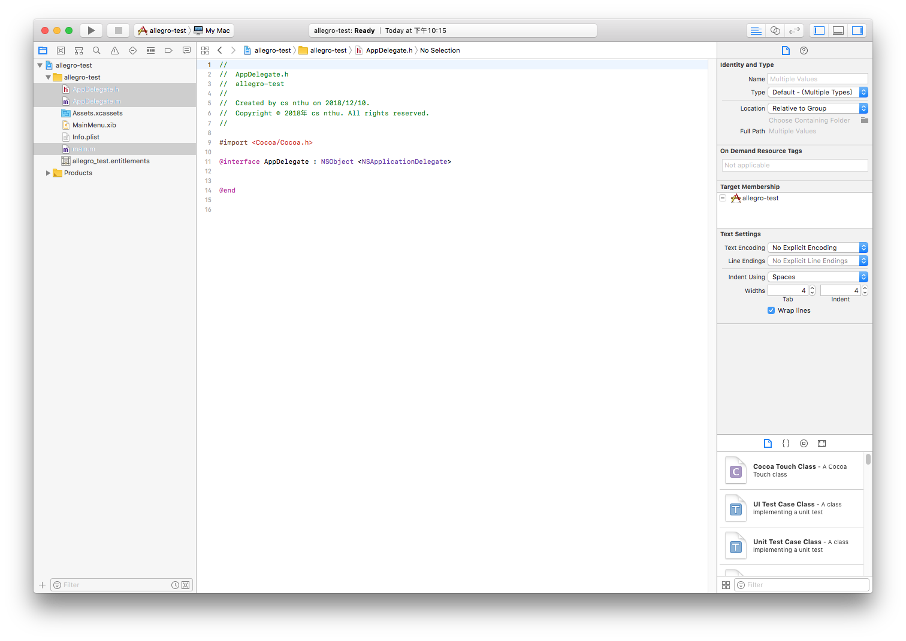
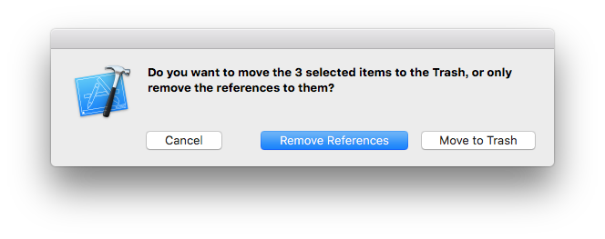
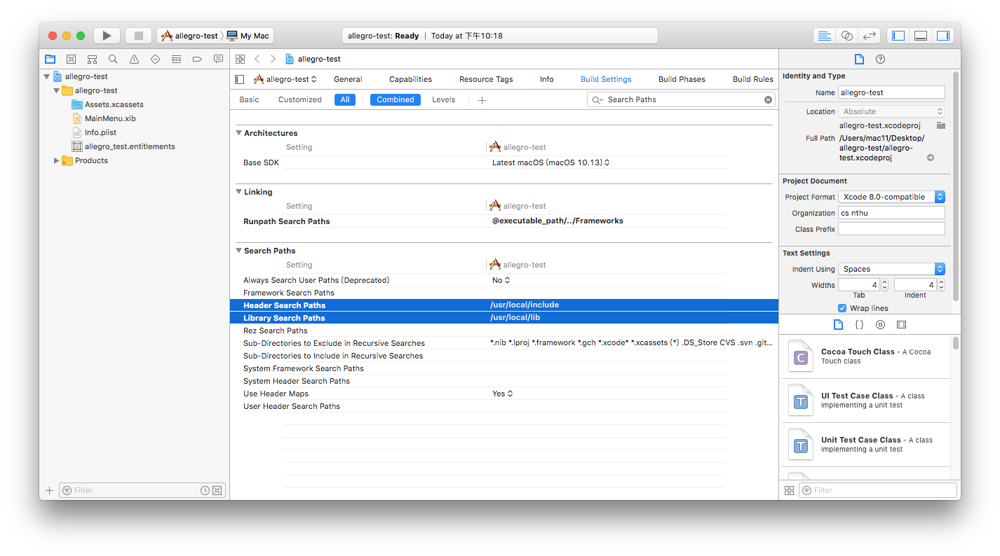
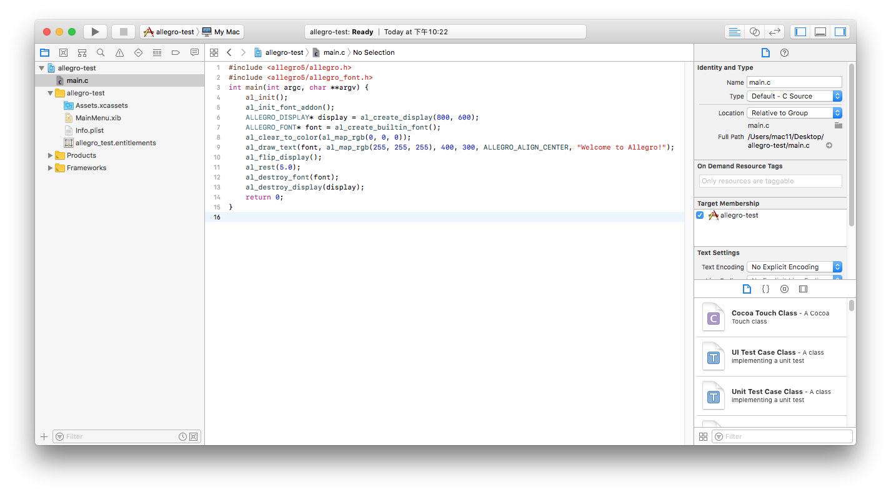
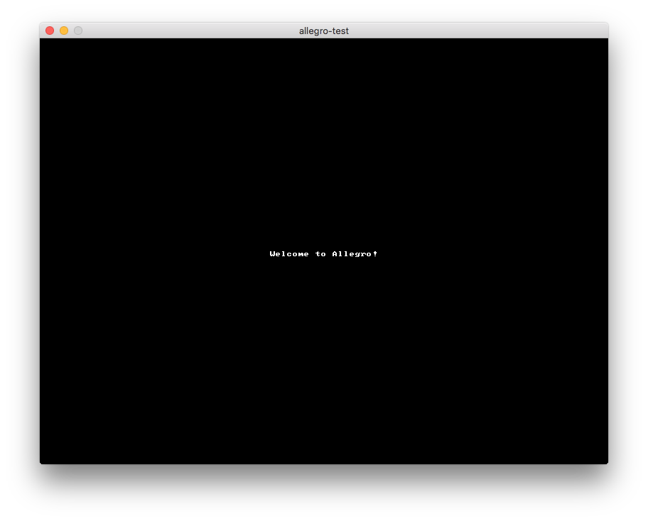

# Installation

> Images in this page are not updated, but most of them are just difference on version. 

- [Note](#note)
- [Linux(Debian)](#linuxdebian)
- [Windows](#windows)
  - [Visual Studio](#visual-studio)
  - [Code::Blocks](#codeblocks)
  - [Dev-C++](#dev-c)
- [Mac OS](#mac-os)
  - [XCode](#xcode)
- [Others](#others)

## Note
If you links Allegro5 libraries by yourself, that is, using a pre-built Allegro5 binaries to setup your project **(For Code::Blocks, Dev-C++, XCode, we do in this way)**, please download the **matched (closest) version of Allegro5 binaries to your gcc(compiler) version**. (You can find them on [Allegro5 Github page](https://github.com/liballeg/allegro5/releases).

For example, if you're using Code::Blocks v20.03 shipped with minGW compiler, your gcc version would be 8.1.0. In this case, please download [pre-built Allegro5 for gcc 8.2.1](https://github.com/liballeg/allegro5/releases/download/5.2.5.0/allegro-x86_64-w64-mingw32-gcc-8.2.1-posix-seh-static-5.2.5.1.zip).

To check your gcc version, open command window, go to the folder where you installed minGW. (".../CodeBlocks/MinGW/bin" for Code::Blocks) And type **"gcc --version"**.


Then go the the Allegro5 github page to find the matched version of pre-built binaries.


## Linux(Debian)

Install Allegro5 by following the [official guide](https://github.com/liballeg/allegro_wiki/wiki/Quickstart)

```shell
cd Final_Codes
make
./pacman
```

To clean object files and executable files, type:

```shell
make clean
```

## Windows

### Visual Studio

**This year we highly recommend you use Visual Studio 2022**

- [Official Guide(English)](https://github.com/liballeg/allegro_wiki/wiki/Allegro-in-Visual-Studio#using-nuget-within-visual-studio)

- [Video tutorial(Chinese)](https://youtu.be/HPHd92nj0Io).

### Code::Blocks

- Follow [Official Guide for MinGW(English)](https://github.com/liballeg/allegro_wiki/wiki/Quickstart#mingw-via-msys2) 

- [Video tutorial(Chinese)](https://youtu.be/6qzWKRxw9eY).

- Linking Allegro5 to Code::Blocks by yourself.
  1. Download [allegro-x86_64-w64-mingw32-gcc-8.2.1-posix-seh-static-5.2.5.1.zip](https://github.com/liballeg/allegro5/releases/download/5.2.5.0/allegro-x86_64-w64-mingw32-gcc-8.2.1-posix-seh-static-5.2.5.1.zip)
  2. Un-zip the file and move it to your C drive. The full path should be like: `C:\allegro-x86_64-w64-mingw32-gcc-8.2.1-posix-seh-static-5.2.5.1\allegro`
  3.  Create a new project
      - Open Code::Blocks
      - `File > New > Project...`
        - Click `Console application` and `Go`.
        - Click `Next`, Select `C` and `Next`.
      - Enter title `allegro-test`, `Next`, `Finish`.
  4. Set up project
      - `Project > Build options...`
      - `[Optional]` In `Compiler settings > Compiler flags`, you can check the `-std=c99` flag if you want to use C99 features.
      - Set up include directories

        Make sure that the focus on the left side is the project name (`allegro-test`). Select `Search directories > Compiler` and click `Add`, paste the following path into the textbox and click `OK`.

        ```
        C:\allegro-x86_64-w64-mingw32-gcc-8.2.1-posix-seh-static-5.2.5.1\allegro\include\
        ```

      - Set up library directories

        Make sure that the focus on the left side is the project name (`allegro-test`). Select `Search directories > Linker` and click `Add`, paste the following path into the textbox and click `OK`.

        ```
        C:\allegro-x86_64-w64-mingw32-gcc-8.2.1-posix-seh-static-5.2.5.1\allegro\lib\
        ```

      - Select `Debug` at the left side. Select `Linker settings` and click `Add`, paste the following path into the textbox and click `OK`.

        ```
        C:\allegro-x86_64-w64-mingw32-gcc-8.2.1-posix-seh-static-5.2.5.1\allegro\lib\liballegro_monolith-debug.dll.a
        ```

      - Select `Release` at the left side. Select `Linker settings` and click `Add`, paste the following path into the textbox and click `OK`.

        ```
        C:\allegro-x86_64-w64-mingw32-gcc-8.2.1-posix-seh-static-5.2.5.1\allegro\lib\liballegro_monolith.dll.a
        ```

      - Click `OK`.

  5.  Test the library
      - Copy the code below and paste to your `main.c` at the left side `Projects > Workspace > [ProjectName](allegro-test) > Sources > main.c`:
        ```c
        #include <allegro5/allegro.h>
        #include <allegro5/allegro_font.h>
        int main(int argc, char **argv) {
            al_init();
            al_init_font_addon();
            ALLEGRO_DISPLAY* display = al_create_display(800, 600);
            ALLEGRO_FONT* font = al_create_builtin_font();
            al_clear_to_color(al_map_rgb(0, 0, 0));
            al_draw_text(font, al_map_rgb(255, 255, 255), 400, 300, ALLEGRO_ALIGN_CENTER, "Welcome to Allegro!");
            al_flip_display();
            al_rest(5.0);
            al_destroy_font(font);
            al_destroy_display(display);
            return 0;
        }
        ```

      - Press `F9` to compile and run.

      - If it pops a `dll not found` error, copy the file below to `[Project Directory]\bin\Debug\`
        ```
        C:\allegro-x86_64-w64-mingw32-gcc-8.2.1-posix-seh-static-5.2.5.1\allegro\bin\allegro_monolith-debug-5.2.dll
        ```

      - Press `F9` and the window will pop out saying "Welcome to Allegro!".

### Dev-C++

- [Video Tutorial(Chinese)](https://youtu.be/lwscVtIUy6k).

## Mac OS

[Official Guide(English)](https://github.com/liballeg/allegro_wiki/wiki/Quickstart#install-with-homebrew)

### XCode

- [Video Tutorial(Chinese)](https://youtu.be/QZdHjFQUQPo).
  - ~~[Video Tutorial(Chinese)](https://youtu.be/7nJNDRCq5o0).~~(Old macOS 10.X)
1. Install allegro by following [Official Guide(English)](https://github.com/liballeg/allegro_wiki/wiki/Quickstart#install-with-homebrew)

2. Open `XCode`, Create a new `MacOS` project, choose `App`.
    - Product Name type `allegro-test`, and for Organization Identifier, you can type anything you want. 
    - For language, choose `Objective-C`, and uncheck all other checkboxes.

    - Delete `AppDelegate.h`, `AppDelegate.m`, `ViewController.h`, `ViewController.m`, `Main.m` and select `Move to Trash`.
    
    

3. Click your project at the left side, go to `Building Settings > All` and search `Search Paths`.

4. Under `Search Paths`, set `Header Search Paths` to `/usr/local/include` and `/opt/homebrew/Cellar/allegro/5.2.7.0/include`(For new `homebrew` case) and set `Library Search Paths` to `/usr/local/lib` and `/opt/homebrew/Cellar/allegro/5.2.7.0/lib`. 
    - Both use `non-recursive`.

    
    **The image is not updated!!**

5. Open terminal and type:
    ```shell
    cd /usr/local/Cellar
    # or /opt/homebrew/Cellar/allegro
    open .
    ```

6. Navigate to `allegro/5.2.7.0/lib/`

7. Sort by `Modified date` and select all files that is modified today. (don't need to select the `pkgconfig` folder)

    

8. Go back to XCode and click `General`.
9. Drag the selected files into the `Frameworks, Libraries, and Embedded Content`.

  

10. Create `main.c` (`File > New > File... > C file`), uncheck `Also create a header file`.
    - Paste the code below to the file.
      ```c
      #include <allegro5/allegro.h>
      #include <allegro5/allegro_font.h>
      int main(int argc, char **argv) {
          al_init();
          al_init_font_addon();
          ALLEGRO_DISPLAY* display = al_create_display(800, 600);
          ALLEGRO_FONT* font = al_create_builtin_font();
          al_clear_to_color(al_map_rgb(0, 0, 0));
          al_draw_text(font, al_map_rgb(255, 255, 255), 400, 300, ALLEGRO_ALIGN_CENTER, "Welcome to Allegro!");
          al_flip_display();
          al_rest(5.0);
          al_destroy_font(font);
          al_destroy_display(display);
          return 0;
      }
      ```

      

11. Click the `Play` button.

  

## Others

Inspect your processor and download the corresponding library:

- [allegro-i686-w64-mingw32-gcc-7.2.0-posix-dwarf-static-5.2.4.1.zip](https://github.com/liballeg/allegro5/releases/download/5.2.4.0/allegro-i686-w64-mingw32-gcc-7.2.0-posix-dwarf-static-5.2.4.1.zip)
- [allegro-x86_64-w64-mingw32-gcc-7.2.0-posix-seh-static-5.2.4.1.zip](https://github.com/liballeg/allegro5/releases/download/5.2.4.0/allegro-x86_64-w64-mingw32-gcc-7.2.0-posix-seh-static-5.2.4.1.zip)
- [allegro-mingw-gcc6.2.0-x86-static-5.2.2.zip](https://github.com/liballeg/allegro5/releases/download/5.2.2.0/allegro-mingw-gcc6.2.0-x86-static-5.2.2.zip)
- [allegro-mingw-gcc6.2.0-x64-static-5.2.2.zip](https://github.com/liballeg/allegro5/releases/download/5.2.2.0/allegro-mingw-gcc6.2.0-x64-static-5.2.2.zip)

Unzip the file and put it under C drive.

Create `main.c` and paste the code below:

```c
#include <allegro5/allegro.h>
#include <allegro5/allegro_font.h>
int main(int argc, char **argv) {
    al_init();
    al_init_font_addon();
    ALLEGRO_DISPLAY* display = al_create_display(800, 600);
    ALLEGRO_FONT* font = al_create_builtin_font();
    al_clear_to_color(al_map_rgb(0, 0, 0));
    al_draw_text(font, al_map_rgb(255, 255, 255), 400, 300, ALLEGRO_ALIGN_CENTER, "Welcome to Allegro!");
    al_flip_display();
    al_rest(5.0);
    al_destroy_font(font);
    al_destroy_display(display);
    return 0;
}
```

Type the command that matches your download.

```shell
gcc -Wall -g -IC:\allegro-i686-w64-mingw32-gcc-7.2.0-posix-dwarf-static-5.2.4.1\allegro\include main.c -LC:\allegro-i686-w64-mingw32-gcc-7.2.0-posix-dwarf-static-5.2.4.1\allegro\lib -lallegro_monolith.dll
```

```shell
gcc -Wall -g -IC:\allegro-x86_64-w64-mingw32-gcc-7.2.0-posix-seh-static-5.2.4.1\allegro\include main.c -LC:\allegro-x86_64-w64-mingw32-gcc-7.2.0-posix-seh-static-5.2.4.1\allegro\lib -lallegro_monolith.dll
```

```shell
gcc -Wall -g -IC:\allegro-mingw-gcc6.2.0-x86-static-5.2.2\allegro\include main.c -LC:\allegro-mingw-gcc6.2.0-x86-static-5.2.2\allegro\lib -lallegro_monolith.dll
```

```shell
gcc -Wall -g -IC:\allegro-mingw-gcc6.2.0-x64-static-5.2.2\allegro\include main.c -LC:\allegro-mingw-gcc6.2.0-x64-static-5.2.2\allegro\lib -lallegro_monolith.dll
```
